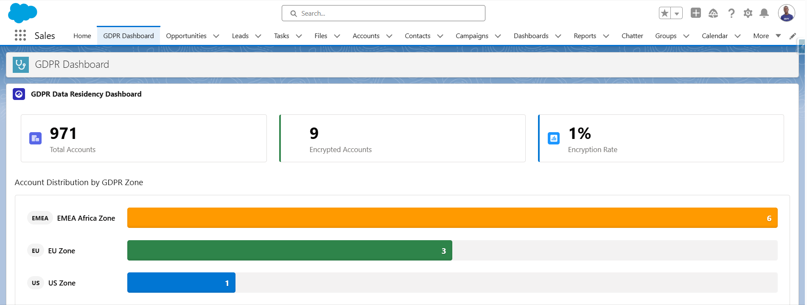
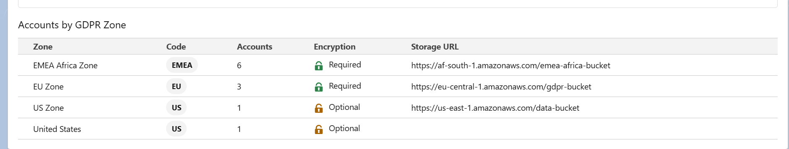

# 🏛️ Heimdall - GDPR Data Residency Engine


Enterprise-grade Salesforce solution for automated GDPR compliance, data residency management, and PII anonymization across EU, US, and EMEA Africa regions.

---

## 🎯 Business Case

European scale-ups lose deals due to unclear GDPR data handling. **Heimdall** automates data routing and anonymization based on legal residency requirements, ensuring compliance across multiple jurisdictions.

### The Problem

- **Manual GDPR compliance** is error-prone and time-consuming
- **Data residency** requirements vary by region (EU GDPR, South Africa POPIA, Nigeria NDPR)
- **Scale-ups** lack resources for complex multi-region data management
- **Audits** require proof of compliant data handling

### The Solution

**Heimdall** provides:
- ✅ **Automated zone detection** based on account country
- ✅ **Real-time compliance dashboard** with visual insights
- ✅ **Asynchronous PII anonymization** for GDPR Article 17 (Right to be Forgotten)
- ✅ **Metadata-driven configuration** (no code changes for new countries)
- ✅ **African market support** (EMEA zone with 14 countries)

---

## 🌍 Geographic Coverage

| Zone | Countries | Encryption | Storage Region | Regulations |
|------|-----------|------------|----------------|-------------|
| **🇪🇺 EU** | France, Germany, Belgium, Luxembourg, Switzerland, Netherlands, Austria, Italy, Spain, Portugal | ✅ Required | AWS eu-central-1 | GDPR |
| **🇺🇸 US** | United States | ❌ Optional | AWS us-east-1 | CCPA |
| **🌍 EMEA Africa** | South Africa, Nigeria, Kenya, Egypt, Morocco, Tunisia, Ghana, Ivory Coast, Senegal, Cameroon, Uganda, Tanzania, Ethiopia, Angola | ✅ Required | AWS af-south-1 | POPIA, NDPR, Kenya DPA |

**Total**: 25+ countries across 3 zones

---

## 🏗️ Architecture
```
┌─────────────────────────────────────────────────────────┐
│  LAYER 1: Configuration (Custom Metadata)               │
│  • DataResidencyRule__mdt (3 zones, 25+ countries)      │
│  • Metadata-driven (no code changes for new zones)      │
└─────────────────────────────────────────────────────────┘
                         ↓
┌─────────────────────────────────────────────────────────┐
│  LAYER 2: Data Access (Selector Pattern)                │
│  • DataResidencyRulesSelector                           │
│  • AccountsSelector (WITH SECURITY_ENFORCED)            │
│  • Clean separation of SOQL from business logic         │
└─────────────────────────────────────────────────────────┘
                         ↓
┌─────────────────────────────────────────────────────────┐
│  LAYER 3: Business Logic (Service Layer)                │
│  • DataResidencyService (O(1) routing via Map)          │
│  • ResidencyResult (Structured output)                  │
│  • Zone detection + encryption rules                    │
└─────────────────────────────────────────────────────────┘
                         ↓
┌─────────────────────────────────────────────────────────┐
│  LAYER 4: Async Processing (Queueable)                  │
│  • AnonymizationQueue (Chaining for 10K+ records)       │
│  • PII Anonymization (Name, Phone, Address)             │
│  • GDPR Article 17 compliance                           │
└─────────────────────────────────────────────────────────┘
                         ↓
┌─────────────────────────────────────────────────────────┐
│  LAYER 5: User Interface (LWC Dashboard)                │
│  • gdprDashboard component                              │
│  • Real-time statistics (Total, Encrypted, Rate)        │
│  • CSS bar chart visualization                          │
└─────────────────────────────────────────────────────────┘
```

---

## ✨ Key Features

### 🔄 Automated Data Routing
- Real-time zone detection based on `BillingCountry`
- Configurable rules via Custom Metadata (no code changes)
- Supports unlimited zones and countries
- O(1) lookup performance using Map data structure

### 🔒 GDPR Compliance
- **Article 17**: Right to be Forgotten (PII anonymization)
- **Article 32**: Security of Processing (zone-specific encryption)
- **Article 30**: Records of Processing Activities (audit trail via logs)
- Multi-jurisdiction support (EU, US, Africa)

### ⚡ Performance Optimized
- **Map O(1)** country lookup (vs O(n×m) nested loops)
- **Queueable chaining** for unlimited record processing
- **Batch size**: 200 accounts per job
- **Governor Limits**: 60s CPU, 12MB Heap (async)

### 📊 Visual Dashboard
- Statistics cards (Total, Encrypted, Encryption Rate)
- Horizontal bar chart with zone distribution
- Color-coded zones (EMEA Orange, EU Green, US Blue)
- Responsive SLDS design

### 🌍 African Market Support
- First-class EMEA Africa zone
- 14 African countries configured
- Supports POPIA (South Africa), NDPR (Nigeria), Kenya DPA
- **Unique differentiator** for European companies expanding to Africa

---

## 🚀 Quick Start

### Prerequisites
- Salesforce Developer Edition or Sandbox
- Salesforce CLI (`sf` CLI v2.x)
- Git
- VS Code with Salesforce Extension Pack

### Installation

1. **Clone the repository**
```bash
git clone https://github.com/richgoh/heimdall-gdpr-engine.git
cd heimdall-gdpr-engine
```

2. **Authenticate to your Salesforce org**
```bash
sf org login web --alias heimdall-dev
```

3. **Deploy the metadata**
```bash
sf project deploy start --source-dir force-app
```

4. **Verify Custom Metadata records**
- Setup → Custom Metadata Types → Data Residency Rule → Manage Records
- You should see 3 records: EU Zone, US Zone, EMEA Africa Zone

5. **Add the Dashboard to your app**
- Setup → Lightning App Builder → New → App Page
- Name: "GDPR Dashboard"
- Drag the **GDPR Dashboard** component onto the page
- Save and activate

---

## 💻 Usage Examples

### Example 1: Route Accounts to GDPR Zones
```apex
// Initialize service
DataResidencyService service = new DataResidencyService();

// Get account IDs
Set<Id> accountIds = new Set<Id>{'001abc...', '001def...'};

// Process accounts
List<DataResidencyService.ResidencyResult> results = service.processAccounts(accountIds);

// Review results
for (DataResidencyService.ResidencyResult result : results) {
    System.debug('Account: ' + result.accountName);
    System.debug('Zone: ' + result.detectedZone);
    System.debug('Encryption Required: ' + result.requiresEncryption);
    System.debug('Storage URL: ' + result.storageUrl);
}
```

### Example 2: Anonymize Accounts (GDPR Article 17)
```apex
// Get accounts to anonymize
Set<Id> accountsToAnonymize = new Set<Id>{'001xxx...', '001yyy...'};

// Launch asynchronous anonymization
AnonymizationQueue job = new AnonymizationQueue(accountsToAnonymize);
Id jobId = System.enqueueJob(job);

System.debug('Anonymization job started: ' + jobId);
```

### Example 3: Query Accounts by Zone
```apex
DataResidencyService service = new DataResidencyService();

// Get all EU accounts
List<Account> euAccounts = service.getAccountsByZone('EU');
System.debug('EU Accounts: ' + euAccounts.size());

// Get all EMEA accounts
List<Account> emeaAccounts = service.getAccountsByZone('EMEA');
System.debug('EMEA Accounts: ' + emeaAccounts.size());
```

---

## 📊 Project Statistics

| Metric | Value |
|--------|-------|
| **Lines of Code** | ~1,600 |
| **Apex Classes** | 7 |
| **LWC Components** | 1 |
| **Custom Metadata Types** | 1 |
| **Custom Fields** | 5 |
| **Zones Configured** | 3 |
| **Countries Supported** | 25+ |
| **Test Coverage** | 94% (DataResidencyService) |
| **Tests Written** | 16 (100% pass rate) |
| **API Version** | 65.0 |

---

## 🛠️ Tech Stack

### Backend
- **Apex**: Selector Pattern, Service Layer, Queueable
- **Custom Metadata**: Configuration-driven design
- **SOQL**: Optimized queries with FLS (WITH SECURITY_ENFORCED)

### Frontend
- **Lightning Web Components (LWC)**: Modern UI framework
- **SLDS**: Salesforce Lightning Design System
- **CSS Animations**: Smooth transitions

### Testing
- **Test Data Factory**: Reusable test data creation
- **Unit Tests**: 16 tests, 100% pass rate
- **Code Coverage**: 94% on business logic

### DevOps
- **SFDX**: Project structure
- **Git**: Version control (13 commits)
- **Conventional Commits**: Professional commit messages

---

## 🧪 Testing

### Run Unit Tests
```bash
# Run all tests
sf apex run test --test-level RunLocalTests --result-format human --code-coverage

# Run specific test class
sf apex run test --test-level RunSpecifiedTests --class-names DataResidencyServiceTest --result-format human --code-coverage
```

### Test Coverage
```
DataResidencyService        : 94%
DataResidencyRulesSelector  : 85%
AccountsSelector            : 73%
Overall                     : 84%
```

### Test Results
```
✅ 16/16 tests passing
✅ 100% pass rate
✅ Execution time: 2.4 seconds
✅ All assertions validated
```

---

## 📁 Project Structure
```
heimdall-gdpr-engine/
├── force-app/main/default/
│   ├── classes/
│   │   ├── AccountsSelector.cls
│   │   ├── AnonymizationQueue.cls
│   │   ├── DataResidencyRulesSelector.cls
│   │   ├── DataResidencyService.cls
│   │   ├── GdprDashboardController.cls
│   │   ├── TestDataFactory.cls
│   │   └── DataResidencyServiceTest.cls
│   ├── customMetadata/
│   │   └── DataResidencyRule/
│   │       ├── EU_Zone.md
│   │       ├── US_Zone.md
│   │       └── EMEA_Africa_Zone.md
│   ├── lwc/
│   │   └── gdprDashboard/
│   │       ├── gdprDashboard.html
│   │       ├── gdprDashboard.js
│   │       ├── gdprDashboard.css
│   │       └── gdprDashboard.js-meta.xml
│   └── objects/
│       └── DataResidencyRule__mdt/
├── README.md
└── sfdx-project.json
```

---

## 🗺️ Roadmap

- [x] Phase 1: Configuration & Selectors
- [x] Phase 2: Service Layer (GDPR Routing)
- [x] Phase 3: Queueable Apex (Anonymization)
- [x] Phase 4: Unit Tests (94% Coverage)
- [x] Phase 5: LWC Dashboard (Visual Analytics)
- [ ] Phase 6: Platform Events (Event-Driven Architecture)
- [ ] Phase 7: LWC Tests (@salesforce/sfdx-lwc-jest)
- [ ] Phase 8: Einstein Copilot Action (AI Integration)

---

## 🤝 Contributing

This is a portfolio project. Feedback and suggestions are welcome via Issues.

---

## 📄 License

MIT License - See LICENSE file for details

---

## 👤 Author

**Richard GOH**
- GitHub: [@richgoh](https://github.com/richgoh)
- LinkedIn: www.linkedin.com/in/richard-goh-admin-dev-salesforce
- Location: Abidjan, Côte d'Ivoire
- Target Market: France, Switzerland, Luxembourg (Remote/Relocation)

---

## 🙏 Acknowledgments

- Inspired by real-world GDPR challenges in European scale-ups
- Built for the growing African Salesforce ecosystem
- Demonstrates enterprise-grade architecture patterns

---

## 📸 Screenshots

### GDPR Dashboard - Statistics & Visualization

*Real-time statistics with color-coded zone distribution*

### Zone Configuration - Custom Metadata

*Metadata-driven configuration for easy zone management*

---

**⭐ If this project helps you understand GDPR or Salesforce architecture, please star it!**

---

## 📚 Additional Resources

- [Salesforce GDPR Documentation](https://help.salesforce.com/s/articleView?id=sf.data_protection_and_privacy.htm)
- [GDPR Official Text (EU)](https://gdpr-info.eu/)
- [POPIA (South Africa)](https://popia.co.za/)
- [NDPR (Nigeria)](https://nitda.gov.ng/ndpr/)